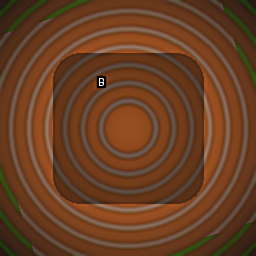

<div align="center">
  

  <h1>Boilify</h1>

  <p><strong>heat distortion OpenFX plugin for DaVinci Resolve Studio 20+</strong></p>

  <p>
    <a href="LICENSE">
      
    </a>
    
    
    
  </p>

  <br />
</div>

## install

1. download zip
2. extract `.ofx.bundle`
3. copy to `/Library/OFX/Plugins` (macOS), `C:\Program Files\Common Files\OFX\Plugins` (windows), or `/usr/OFX/Plugins` (linux)
4. restart resolve

## settings

| parameter | default | effect |
|-----------|---------|--------|
| strength | 1.0 | how far pixels shift |
| density | 2.0 | noise scale. higher = smaller bubbles |
| speed | 1.0 | animation rate |
| seed | 0 | noise seed. change for different patterns |
| animate | on | toggle time-based motion |
| quality | fast | `fast` for responsive preview, `high` for smoother detail |

## algorithm

```
for each pixel:
  noise = perlin(position * density + time * speed)
  offset = (cos(noise), sin(noise)) * strength
  output[x,y] = input[x + offset.x, y + offset.y]
```

perlin noise gives organic motion. trig functions make it circular. looks like heat haze.

## build

```bash
git clone https://github.com/AcademySoftwareFoundation/openfx.git
cmake -S . -B build -DOPENFX_ROOT=./openfx
cmake --build build
```

needs cmake 3.20+, c++17 compiler, OpenFX SDK.

## license

MIT
